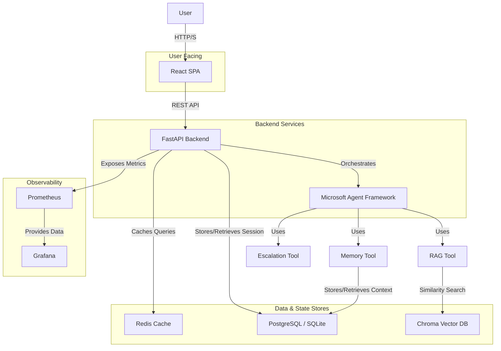
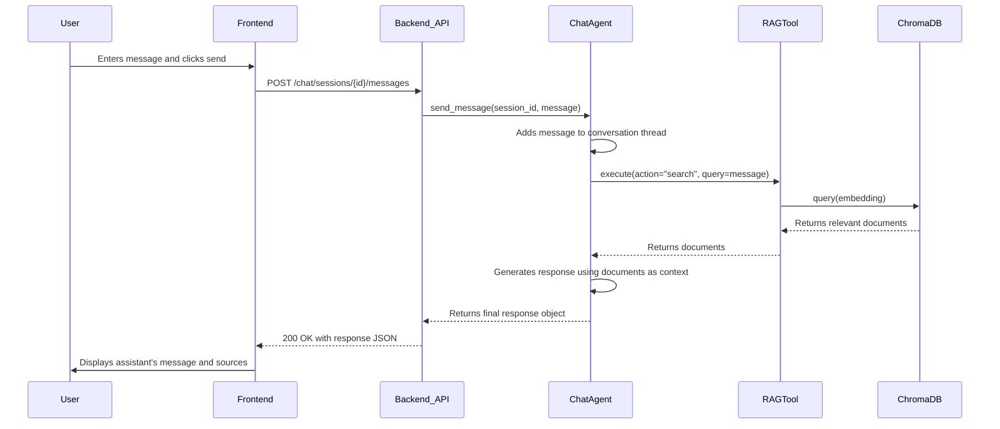

# Project Architecture Document: Customer Support AI Agent

## 1. Introduction

### 1.1. Purpose
This document provides a comprehensive architectural overview of the Customer Support AI Agent system. It details the system's components, their interactions, data flows, and the underlying design principles. This document is intended for developers, architects, and technical stakeholders to understand the system's design and guide future development.

### 1.2. System Overview
The Customer Support AI Agent is a containerized, microservices-based application designed to provide automated, intelligent customer support. It integrates a conversational AI agent with a Retrieval-Augmented Generation (RAG) pipeline to deliver context-aware responses based on a private knowledge base. The system is composed of a React/TypeScript frontend, a Python/FastAPI backend, and a suite of supporting services including data stores and monitoring tools.

## 2. Architectural Drivers & Design Principles

The architecture is shaped by the following key requirements and principles:

- **Modularity & Scalability**: The system is broken down into independent services (frontend, backend, database) that can be scaled independently.
- **Maintainability**: A clear separation of concerns between the frontend UI, backend business logic, and AI agent orchestration simplifies development and maintenance.
- **Real-Time Interaction**: The architecture is designed to support low-latency, real-time chat interactions.
- **Extensibility**: The agent's capabilities are implemented as modular "tools" (`rag_tool`, `memory_tool`), allowing for the easy addition of new functionalities.
- **Reproducibility**: The entire environment is defined within Docker Compose, ensuring consistent setup and deployment across different environments.
- **Observability**: The system includes built-in support for metrics (Prometheus) and logging to ensure operational visibility.

## 3. System Architecture

The application employs a classic microservices architecture.

### 3.1. High-Level Diagram



### 3.2. Component Deep Dive

#### 3.2.1. Frontend (`frontend/`)
- **Description**: A Single-Page Application (SPA) built with React and TypeScript that serves as the user interface for the chat.
- **Core Responsibilities**:
    - Rendering the chat window, messages, and input fields.
    - Managing client-side state for the chat session.
    - Handling user input and file uploads.
    - Communicating with the backend via a RESTful API.
- **Key Files**:
    - `src/hooks/useChat.ts`: The primary React hook responsible for session management, sending messages, and managing the message history.
    - `src/services/api.ts`: An API client (using `fetch`) that encapsulates all HTTP communication with the backend.
    - `src/App.tsx`: The main application component that assembles the UI.

#### 3.2.2. Backend (`backend/`)
- **Description**: A Python application built with the FastAPI framework that serves as the system's central hub.
- **Core Responsibilities**:
    - Exposing a RESTful API for the frontend.
    - Managing user sessions and conversation history.
    - Orchestrating the AI agent to process user messages.
    - Interfacing with all data stores (SQL, Redis, Chroma).
    - Emitting Prometheus metrics for monitoring.
- **Key Files**:
    - `app/main.py`: The FastAPI application entry point. It initializes middleware (CORS, logging) and includes the API routers.
    - `app/api/routes/chat.py`: Defines the core API endpoints for chat functionality (`/chat/sessions`, `/chat/sessions/{session_id}/messages`).
    - `app/core/config.py`: Manages application configuration via environment variables.

#### 3.2.3. AI Agent (`backend/app/agents/`)
- **Description**: The intelligent core of the system, built upon the Microsoft Agent Framework. It processes incoming messages and decides which tools to use to formulate a response.
- **Core Responsibilities**:
    - Maintaining the context of a conversation.
    - Executing a reason-act loop to respond to user queries.
    - Utilizing a suite of tools to perform actions (e.g., searching the knowledge base).
- **Key Files**:
    - `app/agents/chat_agent.py`: The main agent implementation. It defines the agent's instructions (system prompt), initializes its tools, and handles the lifecycle of a conversation thread.
    - `app/tools/`: Directory containing the agent's capabilities.
        - `rag_tool.py`: Interfaces with ChromaDB to perform vector similarity searches.
        - `memory_tool.py`: Manages the persistence and retrieval of conversation history.
        - `attachment_tool.py`: Processes user-uploaded files.
        - `escalation_tool.py`: Handles the logic for escalating a conversation to a human.

#### 3.2.4. Data Stores
- **SQL Database (PostgreSQL/SQLite)**:
    - **Purpose**: The primary store for structured, persistent data.
    - **Data Stored**: User sessions, conversation history, and agent memory.
    - **Implementation**: Managed via SQLAlchemy ORM. The development environment uses a file-based SQLite database for simplicity, while production is configured for PostgreSQL.
- **Chroma Vector Database**:
    - **Purpose**: Stores vector embeddings of knowledge base documents for efficient similarity searching.
    - **Data Stored**: High-dimensional vectors of text chunks and their associated metadata.
    - **Implementation**: The `RAGTool` (`rag_tool.py`) interacts with the ChromaDB instance via its client.
- **Redis**:
    - **Purpose**: In-memory data store used for caching and performance optimization.
    - **Data Stored**: Caches the results of expensive operations, such as RAG queries, to reduce latency on repeated questions.
    - **Implementation**: The `RAGTool` uses a `cache_manager` to store and retrieve query results.

#### 3.2.5. Observability Stack
- **Prometheus**:
    - **Purpose**: A time-series database that scrapes and stores metrics from the backend.
    - **Metrics Collected**: `chat_messages_total`, `chat_message_duration_seconds`, `active_sessions`, etc.
- **Grafana**:
    - **Purpose**: A visualization platform used to create dashboards from the data stored in Prometheus.

## 4. Data Models and Schemas

### 4.1. API Schema (Key Endpoints)

**`POST /chat/sessions`**
- **Purpose**: Create a new chat session.
- **Request Body**: `{"user_id": "string"}` (optional)
- **Response Body**: `{"session_id": "uuid", "thread_id": "uuid", "message": "string"}`

**`POST /chat/sessions/{session_id}/messages`**
- **Purpose**: Send a message and get a response.
- **Request Body**: `multipart/form-data` containing `message: string` and optional `attachments: File[]`.
- **Response Body**:
  ```json
  {
    "message": "string",
    "sources": [
      {
        "id": "string",
        "content": "string",
        "metadata": {"source": "string"},
        "distance": "float"
      }
    ],
    "requires_escalation": "boolean"
  }
  ```

### 4.2. Database Schema (Simplified)
- **`sessions` table**:
    - `id` (string, PK)
    - `user_id` (string)
    - `created_at` (timestamp)
- **`messages` table**:
    - `id` (string, PK)
    - `session_id` (string, FK)
    - `role` (string, e.g., 'user', 'assistant')
    - `content` (text)
    - `timestamp` (timestamp)

## 5. Interaction Diagrams (Sequence Flows)

### 5.1. User Sends a Message



## 6. Deployment and Infrastructure

- **Containerization**: The entire application stack is containerized using Docker. Each component (backend, frontend, redis, etc.) runs in its own container.
- **Orchestration**: Docker Compose is used to define and manage the multi-container application for both development (`docker-compose.yml`) and production (`docker-compose.prod.yml`).
- **Configuration**: Application configuration is managed through environment variables, following the 12-Factor App methodology. A `.env` file is used to supply these variables to the Docker Compose services.
- **Networking**: All services communicate over a custom bridge network (`customer-support-network`) created by Docker Compose, allowing them to resolve each other by service name.
- **Data Persistence**: Data is persisted using Docker volumes for PostgreSQL, Redis, and ChromaDB, ensuring that data is not lost when containers are restarted.

## 7. Cross-Cutting Concerns

- **Logging**: The FastAPI backend uses structured JSON logging. A request ID is added as middleware to trace a single request's lifecycle through the system. All logs are written to `stdout` to be managed by the container runtime.
- **Error Handling**: A global exception handler in `main.py` catches unhandled exceptions, logs the error, and returns a generic 500 Internal Server Error response to the client.
- **Security**:
    - The `README.md` mentions JWT authentication, but the core chat endpoints in the provided code do not appear to be protected, suggesting either public access or that security is handled by an upstream gateway in a full production deployment.
    - Configuration secrets (e.g., `SECRET_KEY`, passwords) are managed via environment variables and should not be hardcoded.
- **CI/CD**: The project includes a `.github/workflows/` directory, indicating that a CI/CD pipeline using GitHub Actions is in place for automated testing and deployment.
